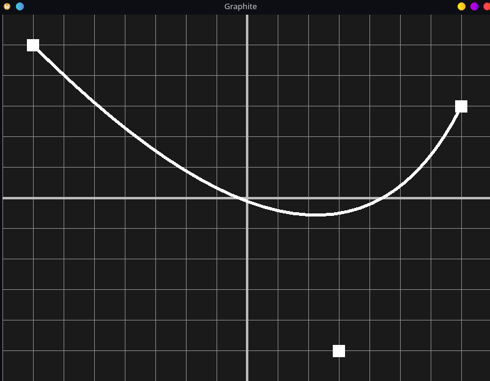
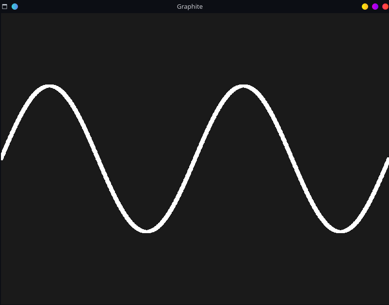

<div align="center">
  <h1>⚪️ Graphite ⚪️</h1>
  <p>Simple, fast 2D/3D math visual app (like GeoGebra) using C++ scripting and hot-reloadable DLLs.</p>
</div>


## About
Graphite is a lightweight 2D/3D math visualization app similar to GeoGebra or matplotlib, but built with C++ scripting and hot-reloadable DLLs for fast interactive development. It uses the author's rendering library [CWindow](https://github.com/daynlight/CWindow).


Why it exists:
- I dislike Python 🐍
- GeoGebra can be slow 🐢
- I enjoy building my own tools 💻
- Learning & experimentation 🎓


Who it's for:
- People who want a faster graphical math app ⚡
- People who hate Python ❤️


## Screenshots
<table>
  <tr>
    <td></td>
    <td></td>
  </tr>
</table>


## Table of Contents
- [About](#about)
- [Screenshots](#screenshots)
- [Installation](#installation)
- [Usage](#usage)
  - [Run](#run)
  - [Flags](#flags)
  - [Path](#path)
- [Important Note ⚠️](#important-note-️)
- [Prerequisites](#prerequisites)
- [Versions and features](#versions-and-features)
- [Other Docs](#other-docs)
- [Cat 🐱](#cat)


## Installation
```bash
git clone --recursive https://github.com/daynlight/Graphite.git
cd Graphite

mkdir -p build
cd build
cmake ..
cmake --build . --config Release
cd ..

sudo ./bin/GraphiteInstaller
cd ..
```


## Usage

### Run
1. Start Graphite:
```bash
Graphite <flags> <path>
```

2. Example script (Graphite.cpp)
```cpp
// Graphite
// Copyright 2025 Daynlight
// Licensed under the Apache License, Version 2.0.
// See LICENSE file for details.

#define  BUILDING_SCRIPT_DLL
#include <Graphite/ScriptInterface.h>
#include <Graphite/Math.h>

#include <math.h>

#define SAMPLES 1000

class Script : ScriptInterface {
  Graphite::Math::Point points[SAMPLES];
  float f(float x) { return (1/2.0f) * sin(x * M_PI * 2); }

  void Init() {
    for (int i = 0; i < SAMPLES; i++) {
      float x = (i / (SAMPLES - 1.0f) * 2) - 1;
      float y = f(x);
      points[i].setPos({x, y});
    }
  }

  void Update() { }

  void Draw() {
    for (int i = 0; i < SAMPLES; i++)
      points[i].drawPoint();
  }

  void Destroy() { }
};

extern "C" ScriptInterface* SCRIPT_API GetScript() {
  Script* script = new Script();
  return (ScriptInterface*)script;
};

extern "C" void SCRIPT_API DeleteScript(ScriptInterface* script) {
  Script* temp_script = (Script*)script;
  delete temp_script;
};
```

### Flags
- -h, --help — show program help
- -i, --init — initialize default files
- -s, --sandbox — enable sandbox mode (recommended for editing)
- -v, -d, --verbose, --debug — verbose / debug output

### Path
The final path is the last argument. If a filename is specified it will create a directory instead.


## Important Note ⚠️
- Use sandbox mode for development and live-editing to avoid crashes: `Graphite -s <path>` or `Graphite -s -v <path>`.
- Sandbox runs the script in a fork for safer testing; if the script crashes, it won't take down the host process.
- Always end all threads and free allocations in `Destroy()` to avoid leaks and undefined behavior.
- When your script is stable, run in normal mode for better performance.
- Sandbox performs an initial test run in the fork before the main execution to catch runtime issues early.


## Prerequisites
- CMake (for building)
- C++17 (compiler)
- Git (for cloning repo and submodules)


## Versions and features

<details>
<summary>v2.0.0</summary>

- [x] Installer
- [ ] Plots
- [ ] Math Interface for Plots
- [ ] Better Point Class
- [ ] Line Class
- [ ] Polynomial Class
- [ ] Ui
- [ ] Templates
</details>

<details open>
<summary>v1.0.1</summary>

- [x] ScriptController edge-case handling
- [x] Sandbox mode now tests before execution
- [x] Edge-case fixes for Graphite, Flags, AppRenderer, ScriptLoader
</details>

<details>
<summary>v1.0.0</summary>

- [x] Sandbox mode
- [x] Script sandbox last-write detection
- [x] Separate CWindow renderer via AppRenderer
- [x] Safer script destroy
</details>

<details>
<summary>Prototype</summary>

- [x] Hot script loading
- [x] Help flag
- [x] Init flag
- [x] Verbose flag
- [x] Points rendering
- [x] Multiple point prints
- [x] Installation guide
- [x] Docs
- [x] Auto create path
</details>


## Other Docs
- [Apache License](LICENSE)
- [Security](SECURITY.md)
- [Contributing](CONTRIBUTING.md)
- [Code of Conduct](CODE_OF_CONDUCT.md)


## Cat 🐱

